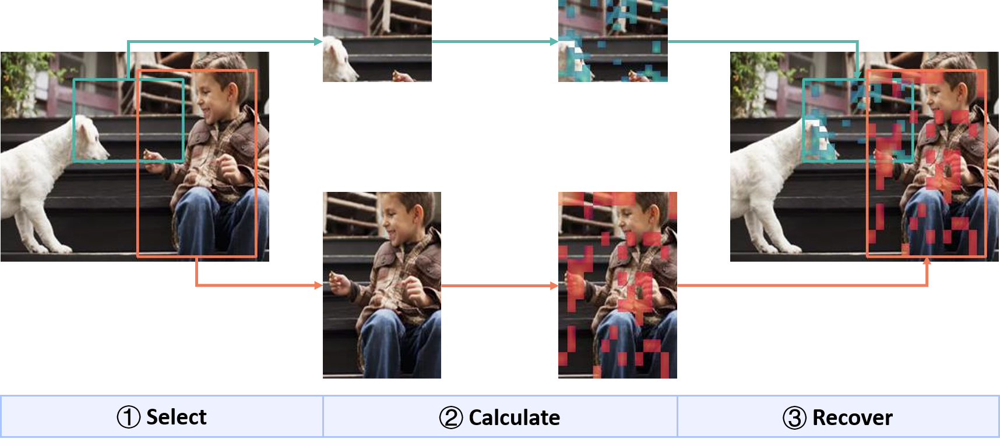
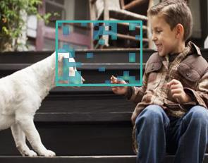
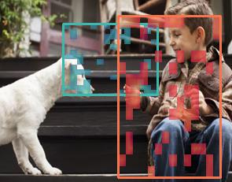

# Visualization of patch tokens which have top k% similarity to cls token.

General workflow:


## Requirements

1. `pip install -r requirements.txt`;

## Usage

```bash
python clip_vis.py -i [img_path] -o [out_path] -b [x1y1x2y2/txt_path] -p [palette:("mako"/"rocket")] -r [top rate%] -a [blend alpha]
```

Example commands:

1. calculate top 25% patch tokens for single box:
```bash
python clip_vis.py -i demo.jpg -o drawn_single.jpg -b 80,30,200,120 -r 0.25 -p rocket
```



2. calculate top 25% patch tokens for multiple boxes:
```bash
python clip_vis.py -i demo.jpg -o drawn_multiple.jpg -b box.txt -r 0.25
```

